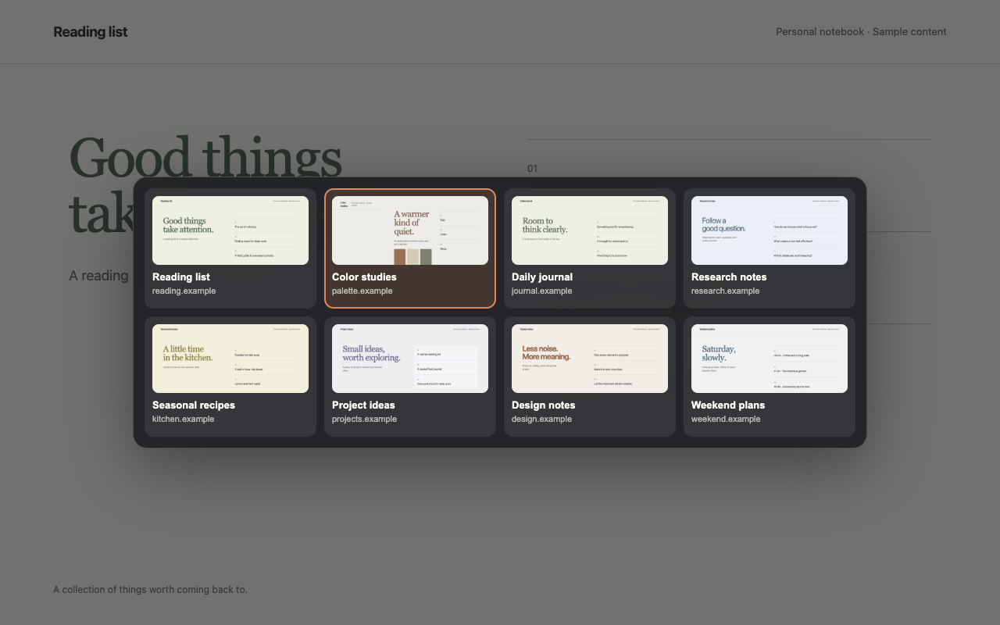

# samsara

A keyboard-driven tab switcher for Chromium browsers. Preview open tabs, cycle through them in recent activity order, and release the modifier key to switch.

## Install for development

Requires Node.js 24 or newer and npm.

1. Install dependencies with `npm ci`.
2. Build the extension with `npm run build`.
3. Open `chrome://extensions` and turn on **Developer mode**.
4. Click **Load unpacked** and select `dist/chrome`.
5. Open the extension popup and choose **Configure shortcuts** to view or change the bindings.

After editing source files, rebuild, reload the extension on the extensions page, and refresh the pages you are testing.

## Use the switcher

Hold the modifier while repeating the shortcut to cycle through tabs. Release the modifier to switch, or press Escape to cancel.

| Action | Windows / Linux default | macOS default |
| --- | --- | --- |
| Next tab | `Ctrl+Shift+Comma` | `Command+Comma` |
| Previous tab | `Ctrl+Shift+Period` | `Command+Shift+Comma` |

Chrome can leave a shortcut unassigned if another shortcut conflicts. Check the bindings in the popup. Browser-protected pages cannot display the overlay; the extension switches tabs directly there.

## Verify changes

Install the test browser with `npx playwright install chromium`, then run `npm run check`. This builds the release package, tests tab-selection logic, and runs real Chromium checks against `dist/chrome`.

## Repository reference

| Path | Purpose |
| --- | --- |
| `src/` | Background worker, tab-selection logic, overlay, and settings UI |
| `icons/` | Runtime PNG icons and editable SVG source |
| `manifest.config.js` | Chrome permissions and extension entry points |
| `package.json` | Name, description, version, dependencies, and commands |
| `scripts/build.mjs` | Generate the unpacked extension and deterministic ZIP |
| `test/` | Business logic and browser tests |
| `store/` | Listing text, reviewer instructions, and image requirements |
| `docs/` | Publishing guide and privacy statement |
| `dist/` | Generated extension and versioned ZIP; excluded from Git |

The build copies an explicit list of runtime files. Add any new runtime asset to that list. It generates the manifest from the configuration and package metadata; the repository root is not an installable extension.

See [publishing](docs/publishing.md), [store materials](store/README.md), and [privacy](docs/privacy.md).
